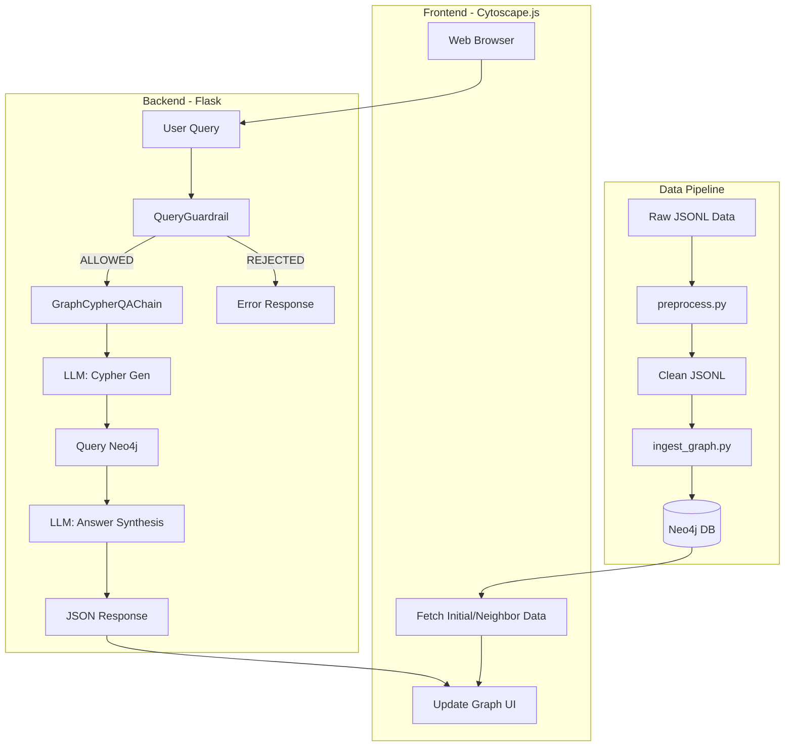
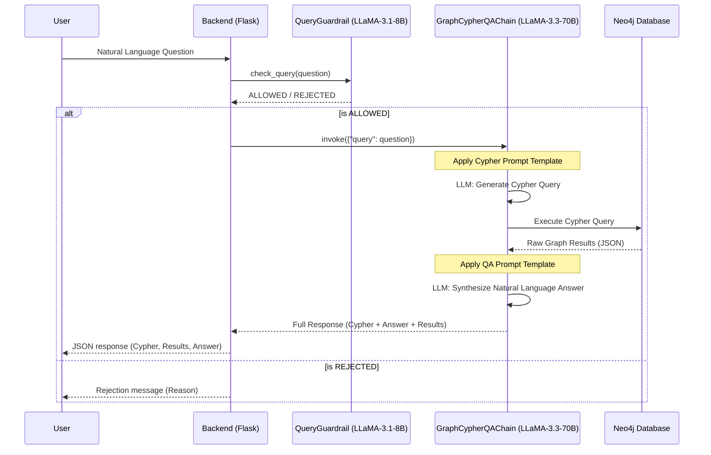

# Graph-Based Data Modeling & Query System

A context-aware graph system with an LLM-powered natural language query interface for SAP O2C (Order-to-Cash) data.

## 🏗️ Architecture

The system is built on a modular pipeline that transforms flat transactional data into an interactive, searchable knowledge graph.

### Core Components:
- **Data Pipeline**:
    - **Preprocessing**: Cleans raw JSONL data, handles missing values, and assigns stable unique ID prefixes (e.g., `SO_`, `DEL_`, `CUST_`) to ensure consistency across the graph.
    - **Ingestion**: A robust Python script that maps preprocessed entities to Neo4j nodes and establishes complex relationships (e.g., `FULFILLS_SALES_ORDER`, `BILLS_CUSTOMER`).
- **Backend (Flask)**:
    - Provides a RESTful API for graph exploration and NLQ execution.
    - Integrates LangChain for orchestrating the LLM-to-Cypher chain.
- **Frontend**:
    - Interactive 2D graph visualization powered by **Cytoscape.js**.
    - Features progressive node expansion, type-based color coding, and a real-time metadata inspector.
    - Integrated chat interface for querying the graph in plain English.

## 🧠 Architecture Decisions

- **Graph Over Relational**: Chosen specifically for SAP O2C data where tracing a Sales Order through Deliveries to Billing involves deep, multi-hop relationship traversals that are inefficient in traditional SQL but native to Graph Databases.
- **Stable ID Prefixes**: Essential for maintaining entity integrity when ingesting data from multiple SAP modules.
- **Asynchronous Graph Loading**: The frontend uses incremental loading for large sub-graphs to maintain performance and responsiveness.
- **Groq Llama 3 Ecosystem**: Leveraging Groq's high-performance inference engine to ensure the natural language interface feels instantaneous.

## 🚀 API Endpoints

| Endpoint | Method | Description |
| :--- | :--- | :--- |
| `/` | `GET` | Serves the main application landing page. |
| `/api/query` | `POST` | Accepts a natural language `question` and returns a Cypher query, results, and simplified answer. |
| `/init` | `GET` | Returns a seed set of nodes and relationships to populate the initial graph view. |
| `/search` | `GET` | Searches the graph for nodes matching search parameter `q` (ID or name). |
| `/neighbors/<node_id>` | `GET` | Fetches immediate neighbors of a specific node (max depth 2 for performance). |
| `/api/nodes_by_ids` | `POST` | Fetches full property details for a list of node IDs. |

## 🗄️ Database Choice: Neo4j

**Neo4j** was selected as the primary data store due to its native support for property graphs and the expressive power of the Cypher query language.

### Key Entities & Relationships:
- **Nodes**: `SalesOrder`, `DeliveryDocument`, `BillingDocument`, `Customer`, `Product`.
- **Relationships**: 
    - `(SalesOrder)-[:PLACED_BY]->(Customer)`
    - `(DeliveryItem)-[:FULFILLS_SALES_ORDER]->(SalesOrder)`
    - `(BillingDocumentItem)-[:REFERENCES_DELIVERY]->(DeliveryDocument)`

## 🤖 LLM Prompting Strategy

The system uses a **two-stage LangChain orchestration** with **LLaMA-3.3-70B**.

### Strategy Details:
1. **Cypher Generation (Few-Shot Prompting)**: Converts natural language questions into valid Cypher queries using a schema-aware prompt populated with specific business logic examples (e.g., defining "delivered but not billed" logic).
2. **Answer Synthesis**: Takes the raw JSON results from the graph and re-contextualizes them into a professional, human-readable response.

## 🛡️ Guardrails

To ensure query safety and domain relevance, the system implements a **Query Guardrail** layer using **LLaMA-3.1-8B**:

- **Classification**: Every user query is pre-screened to identify if it is `IN_DOMAIN` (related to SAP O2C) or `OUT_OF_DOMAIN` (general knowledge, coding, etc.).
- **Filtering**: Out-of-domain queries are rejected with a helpful explanation before reaching the more expensive 70B model, preventing hallucinations and reducing latency/costs.
