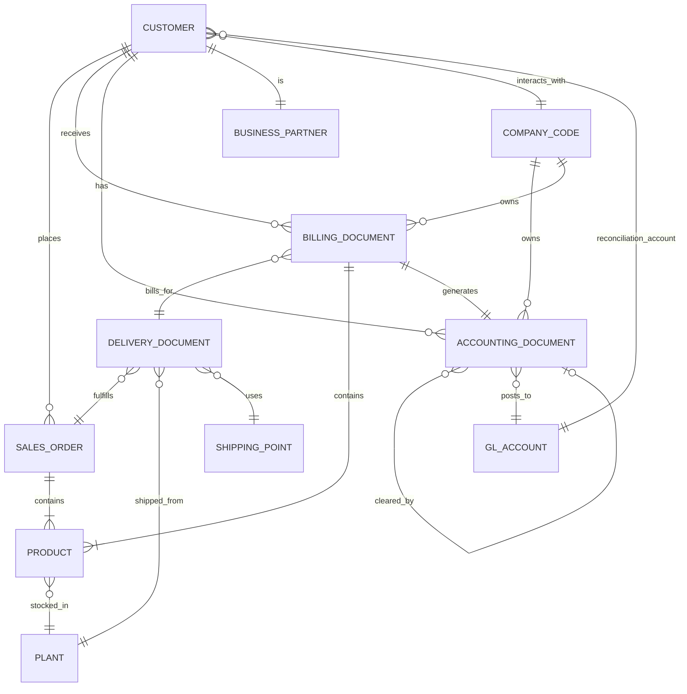

# O2C Preprocessed Data Schema

## Entity Relationship Graph

This subgraph illustrates the relationships between core entities based on foreign keys.



## Tables Structure

Below is the schema (columns) for each dataset in the preprocessed data output.

### `billing_document_cancellations`
```markdown
| Column Name |
| :--- |
| billingDocument |
| billingDocumentType |
| creationDate |
| creationTime |
| lastChangeDateTime |
| billingDocumentDate |
| billingDocumentIsCancelled |
| cancelledBillingDocument |
| totalNetAmount |
| transactionCurrency |
| companyCode |
| fiscalYear |
| accountingDocument |
| soldToParty |
```

### `billing_document_headers`
```markdown
| Column Name |
| :--- |
| billingDocument |
| billingDocumentType |
| creationDate |
| creationTime |
| lastChangeDateTime |
| billingDocumentDate |
| billingDocumentIsCancelled |
| cancelledBillingDocument |
| totalNetAmount |
| transactionCurrency |
| companyCode |
| fiscalYear |
| accountingDocument |
| soldToParty |
```

### `billing_document_items`
```markdown
| Column Name |
| :--- |
| billingDocument |
| billingDocumentItem |
| material |
| billingQuantity |
| billingQuantityUnit |
| netAmount |
| transactionCurrency |
| referenceSdDocument |
| referenceSdDocumentItem |
```

### `business_partner_addresses`
```markdown
| Column Name |
| :--- |
| businessPartner |
| addressId |
| validityStartDate |
| validityEndDate |
| addressUuid |
| addressTimeZone |
| cityName |
| country |
| poBox |
| poBoxDeviatingCityName |
| poBoxDeviatingCountry |
| poBoxDeviatingRegion |
| poBoxIsWithoutNumber |
| poBoxLobbyName |
| poBoxPostalCode |
| postalCode |
| region |
| streetName |
| taxJurisdiction |
| transportZone |
```

### `business_partners`
```markdown
| Column Name |
| :--- |
| businessPartner |
| customer |
| businessPartnerCategory |
| businessPartnerFullName |
| businessPartnerGrouping |
| businessPartnerName |
| correspondenceLanguage |
| createdByUser |
| creationDate |
| creationTime |
| firstName |
| formOfAddress |
| industry |
| lastChangeDate |
| lastName |
| organizationBpName1 |
| organizationBpName2 |
| businessPartnerIsBlocked |
| isMarkedForArchiving |
```

### `customer_company_assignments`
```markdown
| Column Name |
| :--- |
| customer |
| companyCode |
| accountingClerk |
| accountingClerkFaxNumber |
| accountingClerkInternetAddress |
| accountingClerkPhoneNumber |
| alternativePayerAccount |
| paymentBlockingReason |
| paymentMethodsList |
| paymentTerms |
| reconciliationAccount |
| deletionIndicator |
| customerAccountGroup |
```

### `customer_sales_area_assignments`
```markdown
| Column Name |
| :--- |
| customer |
| salesOrganization |
| distributionChannel |
| division |
| billingIsBlockedForCustomer |
| completeDeliveryIsDefined |
| creditControlArea |
| currency |
| customerPaymentTerms |
| deliveryPriority |
| incotermsClassification |
| incotermsLocation1 |
| salesGroup |
| salesOffice |
| shippingCondition |
| slsUnlmtdOvrdelivIsAllwd |
| supplyingPlant |
| salesDistrict |
| exchangeRateType |
```

### `journal_entry_items_accounts_receivable`
```markdown
| Column Name |
| :--- |
| companyCode |
| fiscalYear |
| accountingDocument |
| glAccount |
| referenceDocument |
| costCenter |
| profitCenter |
| transactionCurrency |
| amountInTransactionCurrency |
| companyCodeCurrency |
| amountInCompanyCodeCurrency |
| postingDate |
| documentDate |
| accountingDocumentType |
| accountingDocumentItem |
| assignmentReference |
| lastChangeDateTime |
| customer |
| financialAccountType |
| clearingDate |
| clearingAccountingDocument |
| clearingDocFiscalYear |
```

### `outbound_delivery_headers`
```markdown
| Column Name |
| :--- |
| actualGoodsMovementTime |
| creationDate |
| creationTime |
| deliveryBlockReason |
| deliveryDocument |
| hdrGeneralIncompletionStatus |
| headerBillingBlockReason |
| lastChangeDate |
| overallGoodsMovementStatus |
| overallPickingStatus |
| overallProofOfDeliveryStatus |
| shippingPoint |
```

### `outbound_delivery_items`
```markdown
| Column Name |
| :--- |
| actualDeliveryQuantity |
| batch |
| deliveryDocument |
| deliveryDocumentItem |
| deliveryQuantityUnit |
| itemBillingBlockReason |
| plant |
| referenceSdDocument |
| referenceSdDocumentItem |
| storageLocation |
```

### `payments_accounts_receivable`
```markdown
| Column Name |
| :--- |
| companyCode |
| fiscalYear |
| accountingDocument |
| accountingDocumentItem |
| clearingDate |
| clearingAccountingDocument |
| clearingDocFiscalYear |
| amountInTransactionCurrency |
| transactionCurrency |
| amountInCompanyCodeCurrency |
| companyCodeCurrency |
| customer |
| postingDate |
| documentDate |
| glAccount |
| financialAccountType |
| profitCenter |
```

### `plants`
```markdown
| Column Name |
| :--- |
| plant |
| plantName |
| valuationArea |
| plantCustomer |
| plantSupplier |
| factoryCalendar |
| defaultPurchasingOrganization |
| salesOrganization |
| addressId |
| plantCategory |
| distributionChannel |
| division |
| language |
| isMarkedForArchiving |
```

### `product_descriptions`
```markdown
| Column Name |
| :--- |
| product |
| language |
| productDescription |
```

### `product_plants`
```markdown
| Column Name |
| :--- |
| product |
| plant |
| countryOfOrigin |
| regionOfOrigin |
| productionInvtryManagedLoc |
| availabilityCheckType |
| fiscalYearVariant |
| profitCenter |
| mrpType |
```

### `product_storage_locations`
```markdown
| Column Name |
| :--- |
| product |
| plant |
| storageLocation |
| physicalInventoryBlockInd |
```

### `products`
```markdown
| Column Name |
| :--- |
| product |
| productType |
| crossPlantStatus |
| creationDate |
| createdByUser |
| lastChangeDate |
| lastChangeDateTime |
| isMarkedForDeletion |
| productOldId |
| grossWeight |
| weightUnit |
| netWeight |
| productGroup |
| baseUnit |
| division |
| industrySector |
```

### `sales_order_headers`
```markdown
| Column Name |
| :--- |
| salesOrder |
| salesOrderType |
| salesOrganization |
| distributionChannel |
| organizationDivision |
| salesGroup |
| salesOffice |
| soldToParty |
| creationDate |
| createdByUser |
| lastChangeDateTime |
| totalNetAmount |
| overallDeliveryStatus |
| overallOrdReltdBillgStatus |
| overallSdDocReferenceStatus |
| transactionCurrency |
| pricingDate |
| requestedDeliveryDate |
| headerBillingBlockReason |
| deliveryBlockReason |
| incotermsClassification |
| incotermsLocation1 |
| customerPaymentTerms |
| totalCreditCheckStatus |
```

### `sales_order_items`
```markdown
| Column Name |
| :--- |
| salesOrder |
| salesOrderItem |
| salesOrderItemCategory |
| material |
| requestedQuantity |
| requestedQuantityUnit |
| transactionCurrency |
| netAmount |
| materialGroup |
| productionPlant |
| storageLocation |
| salesDocumentRjcnReason |
| itemBillingBlockReason |
```

### `sales_order_schedule_lines`
```markdown
| Column Name |
| :--- |
| salesOrder |
| salesOrderItem |
| scheduleLine |
| confirmedDeliveryDate |
| orderQuantityUnit |
| confdOrderQtyByMatlAvailCheck |
```

